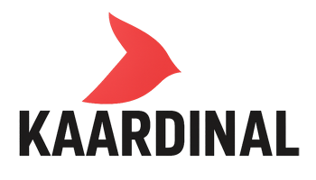
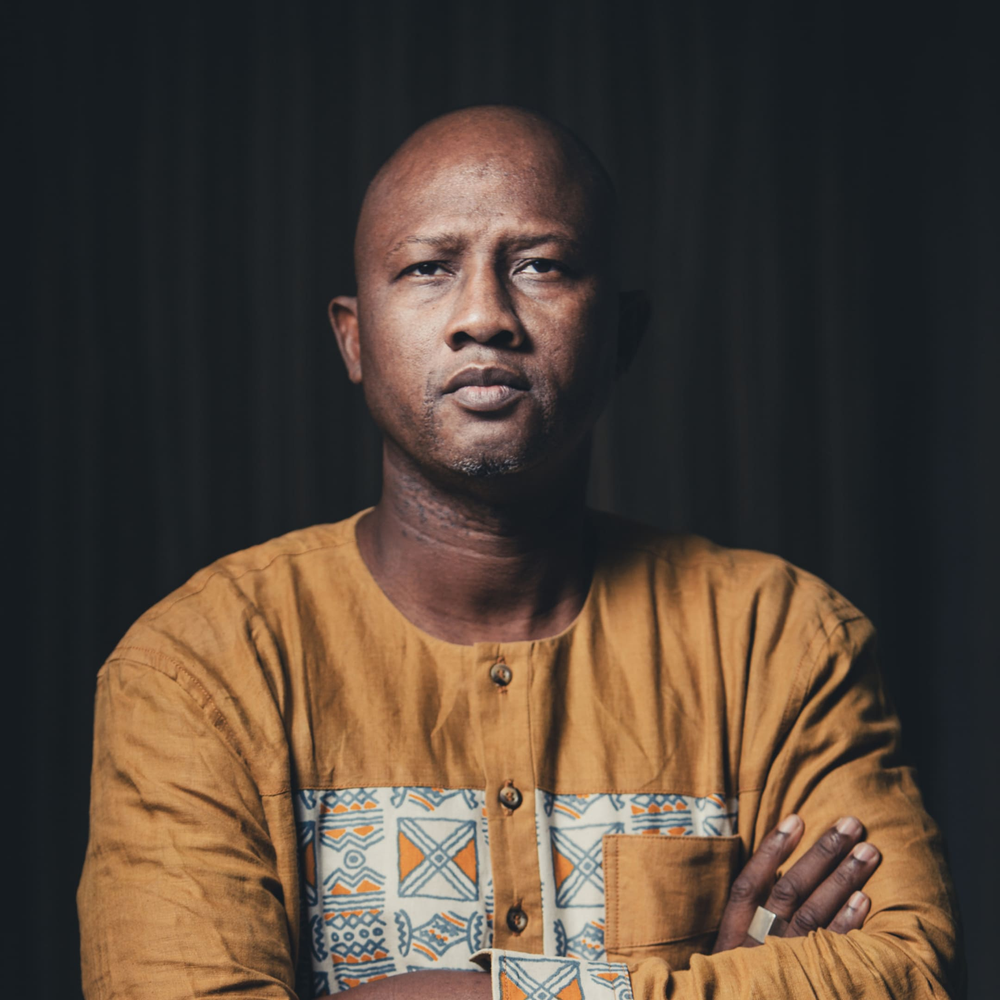
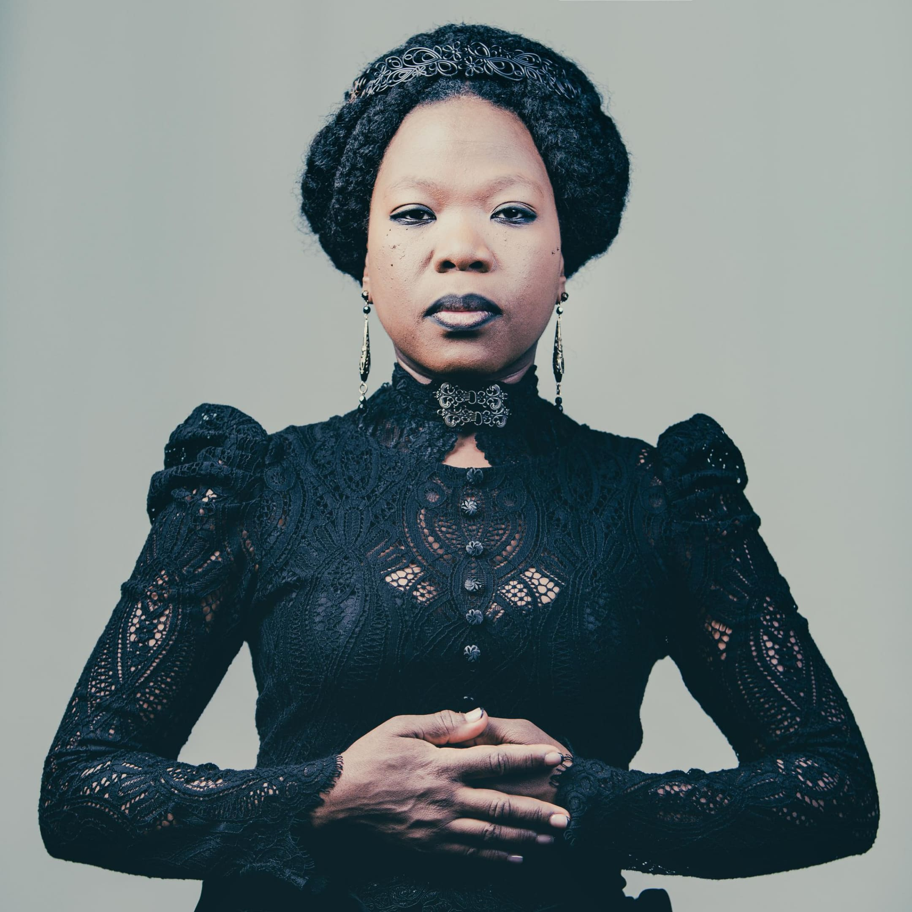
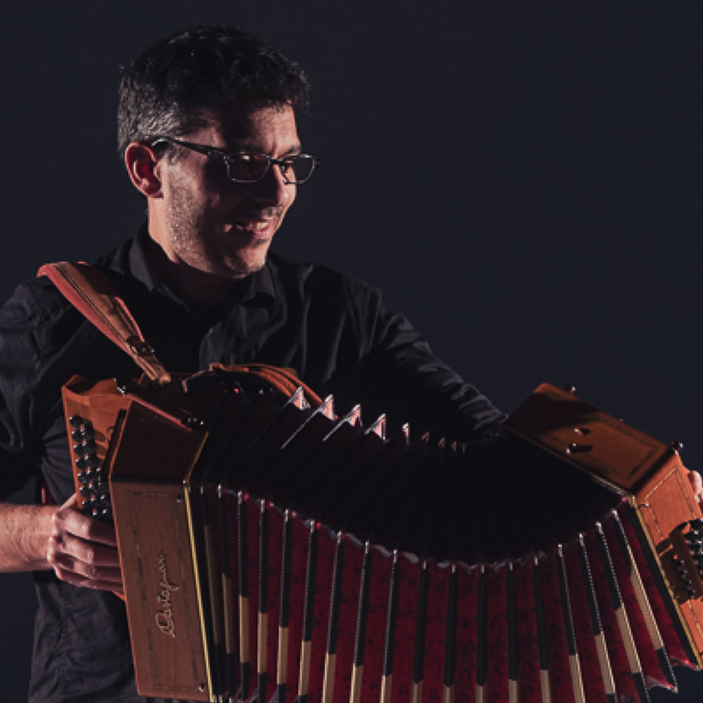
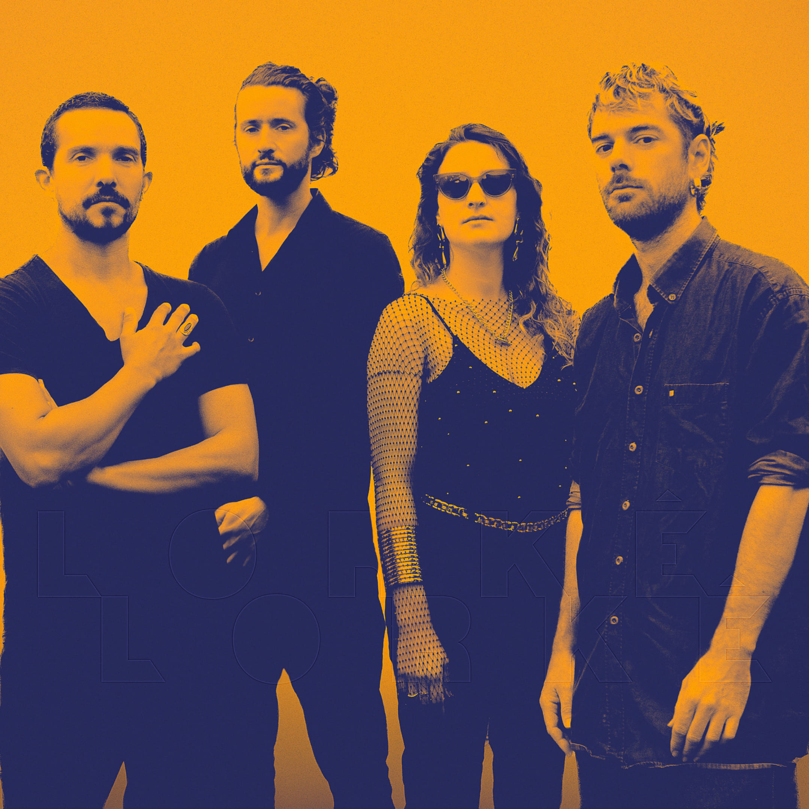
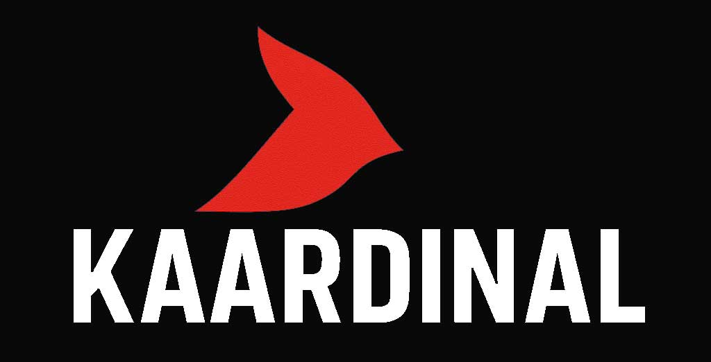

<!-- Logo -->

  

# Kaardinal Publishing

**Independent Music Publisher — France**  
*Éditeur de musique indépendant — France*

  <a href="about.md">About</a> |
  <a href="contacts.md">Contacts</a>

---

## 🎵 Our Artists

  

    
    
Ablaye Cissoko

    

      
      
      
      
    

    

      Master of the kora and one of the purest West African voice, Ablaye Cissoko blends Senegalese tradition with modern elegance in a deeply poetic and spiritual sound.  1M monthly streams, and wordlwide sold-out tours every year?
    
   
  

  
  

    
    
Moonlight Benjamin

   

      
      
      
      
    

     

Vodou Garage / The Punky Voodoo Queen / The Caribbean Patti Smith | Rebellious Caribbean garage blues-rock from Haitian voodoo priestess | A primal scream, a mystifying and mystical musical mixture, almost shamanic, an incantation of liberation in the midst of raging guitars and propulsive drumming.
   
  

  
  

    
    
Selin Sümbültepe

    

      
      
      
      
    

    

Somewhere between Altın Gün, Acid Arab, and Omar Souleyman, Lorkê Lorkê’s compositions take us on a retro-futuristic whirlwind, oscillating between Middle Eastern traditions and electric grooves.    
   
  

  
  

    
    
Cyrille Brotto

    

      
      
      
      
    

     

One of the top3 diatonic accordion master players in Europe, blending tradition and modern tune.     
   
  

  
  

    
    
Lorkê Lorkê

    

      
      
      
      
    

    

Somewhere between Altın Gün, Acid Arab, and Omar Souleyman, Lorkê Lorkê’s compositions take us on a retro-futuristic whirlwind, oscillating between Middle Eastern traditions and electric grooves.    
   
  

  
  <!--

    
    
À venir
  
  
-->

---

## 🤝 Partners (Publishing / Booking)

  
  
  

---

## 📬 Contact Us

<form action="https://formsubmit.co/contact@kaardinal-publishing.com" method="POST">
  <input type="hidden" name="_captcha" value="false">
  <input type="email" name="email" placeholder="Your email" required>
  <input type="text" name="firstname" placeholder="First name" required>
  <input type="text" name="lastname" placeholder="Last name" required>
  <input type="text" name="subject" placeholder="Subject" required>
  <textarea name="message" placeholder="Your message..." rows="6" required></textarea>
  <button type="submit">Send</button>
</form>

<footer>
  

    

      
    

    

      <strong>SASU Kaardinal Publishing</strong> 
      60 rue François 1er - 75008 Paris - France 
      SIREN : 944682137
    

  

</footer>
